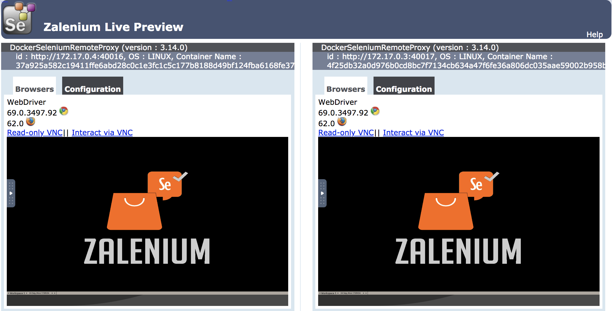
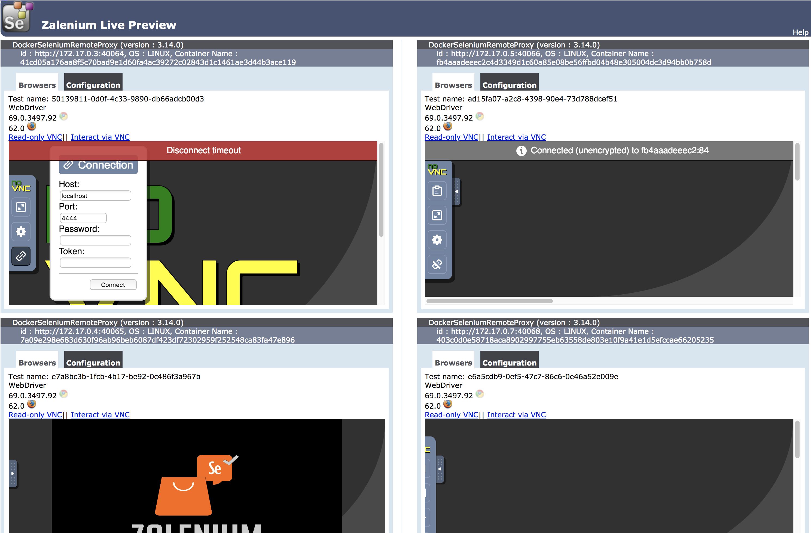
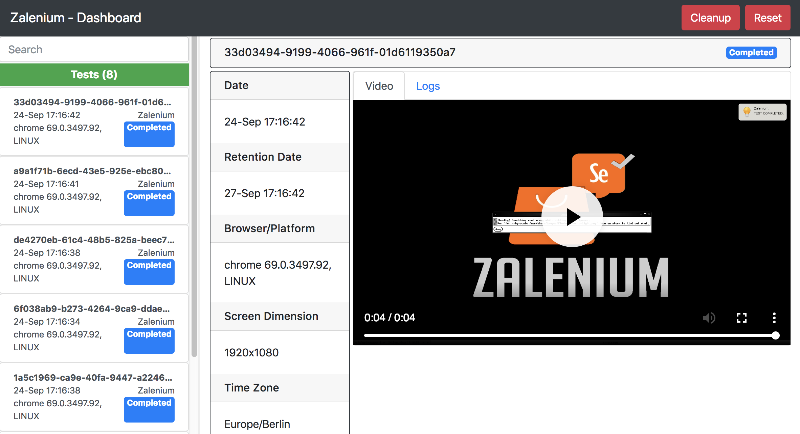

# Auto-Scaling Selenium Grid with Docker and Zalenium


## Accessing Your Machine

We will provide you with a machine IP address which is your Ubuntu Virtual Machine (VM) for the duration of tonight's DevOps Playground.

1. To access your machine first open a Terminal/Command window and enter the following command:
    `ssh @devops{yourIp}`

2. You will be asked about whether you wish to proceed, type `yes` and press return.
    
3. You will be prompted for a password. The password for all machines is `playground`. 

## What Have We Already Set Up On Your Ubuntu VM?

- Docker - https://docs.docker.com/
- NodeJs - https://nodejs.org/en
- NPM - https://www.npmjs.com/ 

## Installing Zalenium and Docker-Selenium

To install Zalenium and Selenium for Docker. 

1. To install docker-selenium run the following command in your ssh session:
    `docker pull elgalu/selenium`

2. To install Zalenium, run the following command in your ssh session:
    `docker pull dosel/zalenium`

## Running Zalenium

1. In your ssh terminal/command window enter the following:

     ```
     docker run --rm -ti --name zalenium -d -p 4444:4444 \
     -v /var/run/docker.sock:/var/run/docker.sock \
     -v /tmp/videos:/home/seluser/videos \
     --privileged dosel/zalenium start
     ```

    The above command runs Zalenium and exposes port 4444.  
    It allows Zalenium to create more Selenium Grid docker containers.  
    It sets a local temporary location for videos to be saved.  
    Running it privileged is optional, but it does help to speed up the registration of containers.  

2. After a few seconds, in your browser on your local machine, access http://yourIp:4444/grid/admin/live?refresh=15.
    You should see two Selenium Grid containers with one instance each of Firefox and Chrome. This is by default.

    

## Running Zalenium - Running a Selenium Test

1. You first want to create a directory for the Playground repository to be pulled into. Enter the following command into your ssh session:  
`mkdir myProject`

2. Change directory to your 'myProject' folder:  
`cd myProject`

3. We now want to clone the DevOps Playground repository into our new folder within our ssh session. Perform the following:  
`git clone https://github.com/ecsdigital/devopsplayground-edi-8-zalenium.git`

4. You now want to change directory into the devopsplayground repository you just cloned.  
`cd devopsplayground-edi-8-zalenium`

4. To run the tests, enter the following command
`./node_modules/.bin/wdio wdio.conf.js`

5. Whilst this is running, you can observe the number of Selenium Grid containers being created at: http://yourIP:4444/grid/admin/live?refresh=15 as the tests are being run.

    

6. Once the tests are finishing you can observe, on the same page, the number of instances scale down.

7. You can also view recorded videos by accessing http://yourIp:4444/dashboard. This provides you with a history of the tests which have been run and their status.

    

8. To view logs for each test, click on the instance from the left hand menu. From there you can view a video recording of the test as well as Selenium and Browser log information.

## Closing Zalenium

1. Once your tests are finished you will probably want to shut down Zalenium. To do this enter the following command:

`docker stop zalenium`

To verify that this has closed correctly, access the Console page here: http://yourIp:4444/grid/console . You should have a page not found error.

